## Agenda

1.  About All of Us
2.  What's new in Workbench 2.0
3.  Getting access
4.  Data collections
5.  Workspaces
6.  Billing
7.  Setting up a workspace
8.  Data Explorer (cohorts + datasets)
9.  Apps
10. Storage and costs

## Learning Objectives

After this training, you should be able to:

- Explain the All of Us Research Program and its key data sources
- Describe what changed between the classic Workbench and Workbench 2.0
- Create a workspace and add an All of Us data collection
- Build a cohort and dataset with Data Explorer
- Launch an analysis app and find your exported data
- Manage storage and costs

## Course Progression

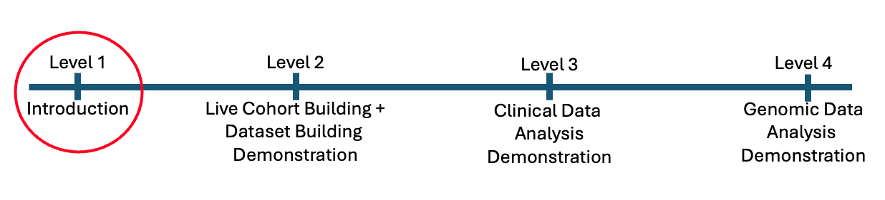{fig-align="center"}

::: notes
Course progression graphic reused from Session 1. Update it if the Level 2–4 sessions now use Workbench 2.0.
:::

# About All of Us

## Background

- A national initiative by the NIH
- Launched in 2018
- Goal: gather health data from **over 1 million people**
- Participants join voluntarily
  - by signing up at [JoinAllofUs.org](https://joinallofus.org)
  - or through a participating health care provider

## Vision and Goals

- Enable precision medicine using data on lifestyle, environment, and genetics
- Shift from one-size-fits-all to personalized healthcare
- Boost health research and medical breakthroughs
- Make healthcare tailored and equitable
- Support diverse studies reflecting all populations

## What Makes It Unique

- **Participant-centered:** participants can view and access their own data
- **Open science:** de-identified data available to registered researchers
- **Research opportunities:** health disparities, environmental impacts, disease prevention and treatment
- **Phenotypic and genotypic data** in one place
- **Scalability and innovation:** complex analyses, AI and machine learning

## Data Sources

|   | Source | Description |
|------------------------|------------------------|------------------------|
| 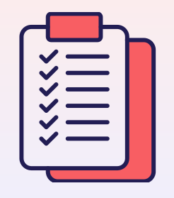{height="60"} | **Surveys** | Lifestyle, medical history, healthcare access, etc. |
| 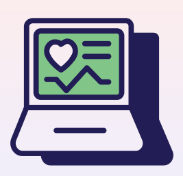{height="60"} | **EHR** | Standardized with the OMOP Common Data Model |
| {height="60"} | **Wearables** | Heart rate, activity, or sleep data from devices like Fitbit |
| 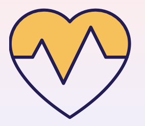{height="60"} | **Physical measurements** | EHRs, self-reported height and weight, in-person visits |
| 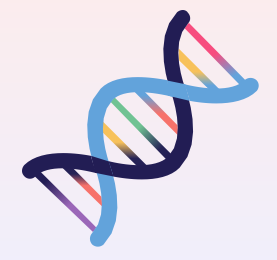{height="60"} | **Genomic** | Whole genome sequencing and genotyping from blood, saliva, and urine |

## The Curated Data Repository (CDR)

- Data are organized in a **curated data repository (CDR)**
  - De-identified
  - Cleaned, validated, standardized (OMOP CDM)
  - Released in numbered versions (current: **CDRv9**)
- Hosted on **Google Cloud Platform**, queried with **Google BigQuery**
  - SQL-based; usable from R or Python
  - Billed for queries run and data processed (large genomic queries can be costly)

::: notes
CDRv9 is shown on the Workbench 2.0 home page (Controlled Tier tutorial workspace). TODO: add CDRv9 participant counts.
:::

## Data Access Tiers

- **Registered Tier:** EHR, surveys, social determinants of health, lab results, physical measurements, and wearables (sensors)
- **Controlled Tier:** everything in the Registered Tier **plus genomic data**
  - Requires additional Controlled Tier training
- Each tier is available in Workbench 2.0 as a **data collection**

# What's New in Workbench 2.0

## Researcher Workbench 2.0

- Built on **Verily Workbench**, the new platform behind the All of Us Researcher Workbench
- Modern interface with:
  - **JupyterLab** (in place of classic Jupyter Notebook)
  - A new **Data Explorer**
  - **Git repository** integration
  - Improved batch workflow support
  - A more organized storage system

## Classic Workbench → Workbench 2.0

| Classic Workbench | Workbench 2.0 |
|------------------------------------|------------------------------------|
| Cohort Builder + Concept Selector + Dataset Builder | **Data Explorer** (one tool) |
| Workspace has CDR version + tier | Workspace + **data collection** added from the catalog |
| Cloud Analysis Environment | **Apps** (e.g., JupyterLab, RStudio) |
| Jupyter Notebook | **JupyterLab** |
| Workspace bucket | Workspace **Resources** (cloud storage) |

::: notes
Based on the All of Us "Researcher Workbench 2.0 Glossary of Terms and Comparison Guide". TODO: check the last row and any renamed terms against the guide.
:::

# Getting Access

## Create Your Account

1.  Create an account at the [All of Us Research Hub](https://www.researchallofus.org/)
2.  Complete data access registration
    - ID verification
    - Mandatory trainings
    - Data User Code of Conduct
3.  For Controlled Tier data, complete the **Controlled Tier training**

::: notes
TODO: add screenshots of the registration pages.
:::

## Logging In

:::::: columns
::: {.column width="50%"}
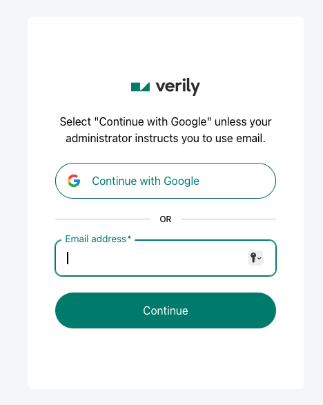
:::

:::: {.column width="50%"}
- Go to [**workbench.verily.com**](https://workbench.verily.com/)
- Select **Continue with Google**
- Sign in with your **All of Us account** (`yourname@researchallofus.org`), not your Yale or personal Google account

::: callout-tip
Use **Google Chrome** to log in.
:::
::::
::::::

::: notes
workbench.verily.com redirects to the Verily sign-in page. Make sure your data access requirements (trainings, etc.) are up to date before logging in.
:::

## The Home Page

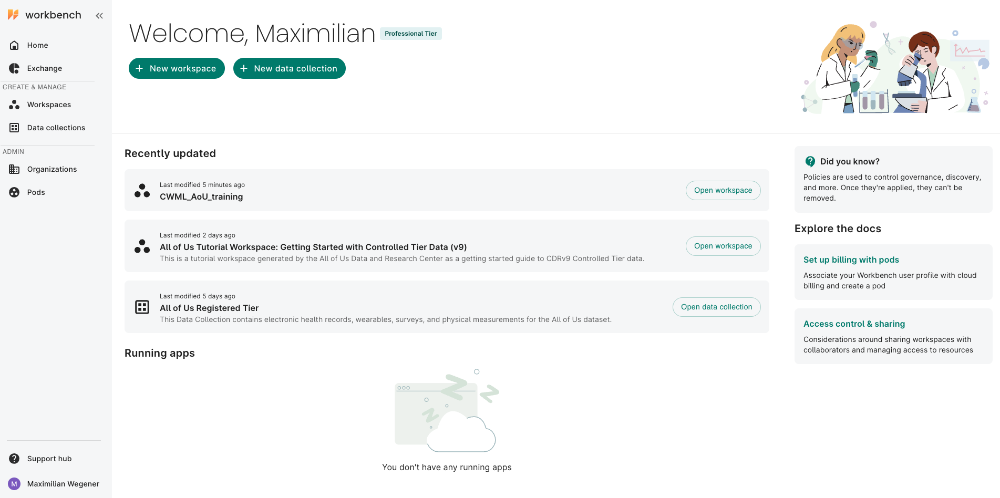{fig-align="center"}

::: notes
Screenshot shows the presenter's name. Crop it if needed.
:::

## Getting Around

::::: columns
::: {.column width="50%"}
**Left sidebar**

- **Home:** recent workspaces and data collections, plus running apps
- **Exchange:** the data catalog for browsing data collections
- **Workspaces:** your workspaces
- **Data collections:** collections you have access to
- **Pods:** billing (see Billing)
- **Support hub:** help and documentation
:::

::: {.column width="50%"}
**Home page**

- **+ New workspace**
- **Running apps:** check here so you don't pay for apps you forgot to stop!
- **Tutorial workspace:** *Getting Started with Controlled Tier Data (v9)*, a good place to start
- **Did you know?** Policies can't be removed once applied
:::
:::::

::: notes
TODO: confirm what "Organizations" (under Admin) means for All of Us users.
:::

# Data Collections

## What Is a Data Collection?

- A **curated dataset** published for researchers, e.g., the All of Us Registered Tier
- Comes with:
  - **Versions** (e.g., cdrv9)
  - **Policies** on how the data can be accessed and used
  - **Access levels** (Reader, Discover, …)
- You **don't copy** the data. Adding a collection to a workspace creates **references** to data that stays in the provider's cloud project.
- The workspace **inherits the collection's policies**, permanently

::: fragment
**Think of it as:** *data collection* = the data source; *workspace* = where you analyze it
:::

::: notes
Verily calls these "referenced resources". Because the data isn't copied, adding it is free; you pay for the queries and compute you run on it.
:::

## The Data Exchange

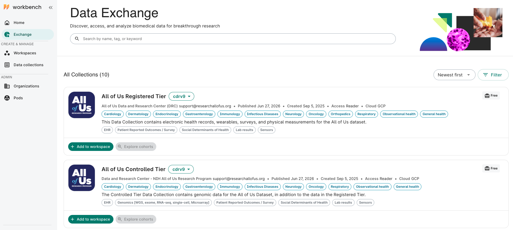{fig-align="center"}

::: notes
Open from the left sidebar: Exchange. Search by name, tag, or keyword; sort and filter.
:::

## All of Us Data Collections

|   | **Registered Tier** | **Controlled Tier** |
|------------------------|------------------------|------------------------|
| **Contains** | EHR, surveys, social determinants of health, lab results, wearables (sensors), physical measurements | Everything in the Registered Tier **plus genomics**: WGS, exome, RNA-seq, single-cell, microarray |
| **Use it for** | Clinical, survey, and lifestyle research: phenotypes, outcomes, health disparities | Genetic association studies (e.g., GWAS), variant analysis, and anything that needs genomic data |
| **Access** | Registered Tier training | **Controlled Tier** training |
| **Version** | Select from the version drop-down (current: **cdrv9**) | Same |

- Both are **free** to add (you pay only for compute and storage)
- **Add to workspace** straight from the Exchange, or from a workspace's **Resources** tab
- Pick the **smallest tier you need**. You can't have both tiers in one workspace.

::: notes
The Exchange lists 10 collections in total. Show the others in the live demo.
:::

## Other Collections on the Exchange {.compact}

| Collection | Provider | What it is | Data types |
|------------------|------------------|------------------|------------------|
| **GTEx Open Access** | Verily | Gene expression and its link to genetic variation | Genomics |
| **GP2 Tier 2** | Global Parkinson's Genetics Program | Parkinson's genetics, 70,000+ people | Genomics, surveys |
| **ASAP CRN Harmonized** | Aligning Science Across Parkinson's | Harmonized Parkinson's omics | Transcriptomics |
| **Project Baseline (Full)** | Verily | Deep health profiling study | EHR, genomics, imaging, eCRF, labs, sensors |
| **Project Baseline (Limited)** | Verily | Free subset of the full study | Imaging, surveys, eCRF, labs |
| **PRESCO Immune Profiler** | Verily | COVID-19 immune profiling, Long COVID (PASC) | Genomics, proteomics, labs |
| **Sightline Wastewater** | Verily | Community pathogen monitoring | Microbiomics |
| **Cervical Cancer: SDOH Screening** | Morehouse School of Medicine | Researcher-published collection | Immunology |

::: notes
Show these in the live demo.
:::

## Access Levels on the Exchange

- **Reader → Add to workspace:** you can add it right away
  - All of Us Registered and Controlled Tiers, GTEx Open Access
- **Discover → Get access:** you can see the description but have to **request access** first
  - **Instantly Accessible:** access is granted right away (PRESCO, Baseline Limited)
- **Free** badge: no charge for the data itself. Collections without it may cost money or need approval.
- **Explore cohorts:** preview a collection's cohorts in Data Explorer before adding it

::: notes
The non-All of Us collections come from Verily and its partners. Their terms are separate from the All of Us Data User Code of Conduct. TODO: check whether non-AoU collections can be added to a workspace with an All of Us data collection (perimeter policies may block it). TODO: confirm what Explore cohorts does; it was grayed out in the screenshots.
:::

## Your Data Collections Page

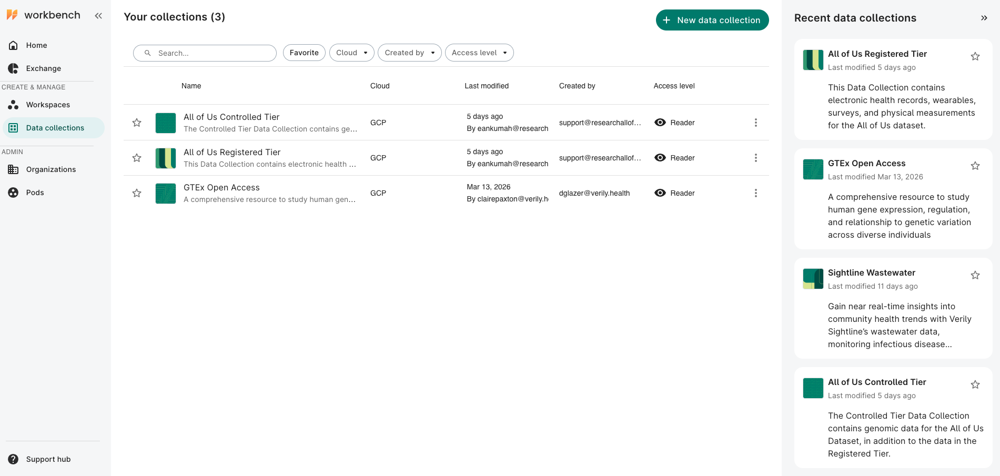{fig-align="center"}

## Using the Data Collections Page

- **Left sidebar → Data collections** lists every collection you have access to
  - Name, cloud (GCP), last modified, created by, and your **access level**
  - Filter by favorite, cloud, creator, or access level; ⭐ favorites to pin them
- **Reader** = you can view and use the data, but not change the collection
- The **Recent data collections** panel lists the ones you've opened lately
- **+ New data collection:** researchers can publish their own collections (e.g., the Morehouse collection on the Exchange)

::: fragment
**Exchange** = find and get access to collections · **Data collections** = the ones you already have
:::

::: notes
Collections only appear here after you have access: the All of Us tiers via your account access, GTEx because it's open. Creating a collection is beyond this intro.
:::

# Workspaces

## Your Workspaces

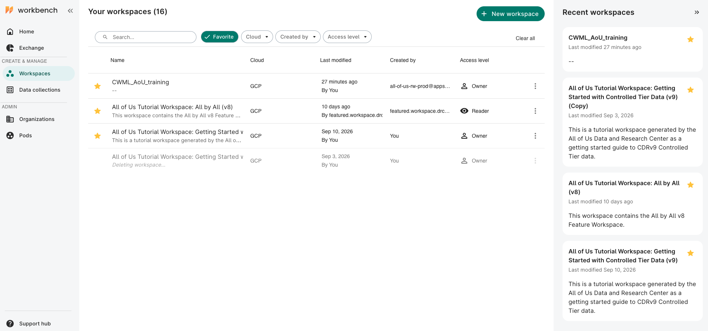{fig-align="center"}

## What Workspaces Are For

- A workspace is **where you do your research**: data collections, cohorts, datasets, notebooks, apps, and files for one project
- Have **more than one** (e.g., one per project or per tier)
- **Shareable** with collaborators
- **Billed individually** through the workspace's **pod**, so set up billing first

## Using the Workspaces Page

- **Left sidebar → Workspaces** lists every workspace you can access
  - Filter by favorite, cloud, creator, or access level; ⭐ favorites to pin them
  - **Recent workspaces** panel on the right
- **Owner:** you created it (or were made owner); you can edit, share, and delete it
- **Reader:** view only. Featured tutorial workspaces are Reader, so **duplicate** them to run the code (the "(Copy)" workspace)

::: notes
Featured tutorial workspaces shown: "Getting Started with Controlled Tier Data (v9)" and "All by All (v8)". The greyed-out row shows a workspace being deleted; deleting unused workspaces stops their charges.
:::

# Billing

## Initial Credits

- **\$300 in initial credits** per registered researcher
  - Applied automatically to compute costs
  - **Expire 365 days** after you first get Workbench access
- When credits run out or expire:
  - You can't launch or open analysis environments
  - Stored resources (buckets, disks) **may be deleted**
- Set up a **Google Cloud billing account** and **billing pod** *before* this happens

## Billing Pods

- A **pod** connects your workspaces to a Google Cloud billing account
  - Workspace costs are charged to the pod
  - Think of the pod as your billing account inside the Workbench
- One pod can pay for **many workspaces**
- You can **invite other users** to your pod (e.g., lab members)
- All of Us researchers have the **Pod Manager** role, so you can create your own pod

::: fragment
**Watch out:**

- A pod links to only **one** billing account
- A workspace's pod **can't be changed** later. To switch pods, you have to duplicate the workspace.
:::

::: notes
TODO: confirm how initial credits appear in 2.0 (e.g., as a default pod) and add a screenshot of the Pods page.
:::

## Getting a Billing Account at Yale

Email **cloud.support\@yale.edu** with the subject **"setting up an All of Us billing account"** and include:

- Your All of Us Workbench email (e.g., `yourname@researchallofus.org`)
- Your **COA** number
- Whether this is an **NIH-funded** project

Yale Cloud Support will send the next steps for linking the billing account and creating your **pod**.

::: notes
Yale Cloud Support may give additional or different guidance.
:::

# Setting Up a Workspace

## Creating a Workspace

**Left sidebar → Workspaces → + New workspace**

:::: annotated

::: {.red-circle style="left: 66.2%; top: 0.6%; width: 11.6%; height: 7.6%;"}
:::
::::

::: notes
Three steps: Enter details → Set policies → Add description.
:::

## Step 1: Enter Details

:::::: columns
::: {.column width="55%"}
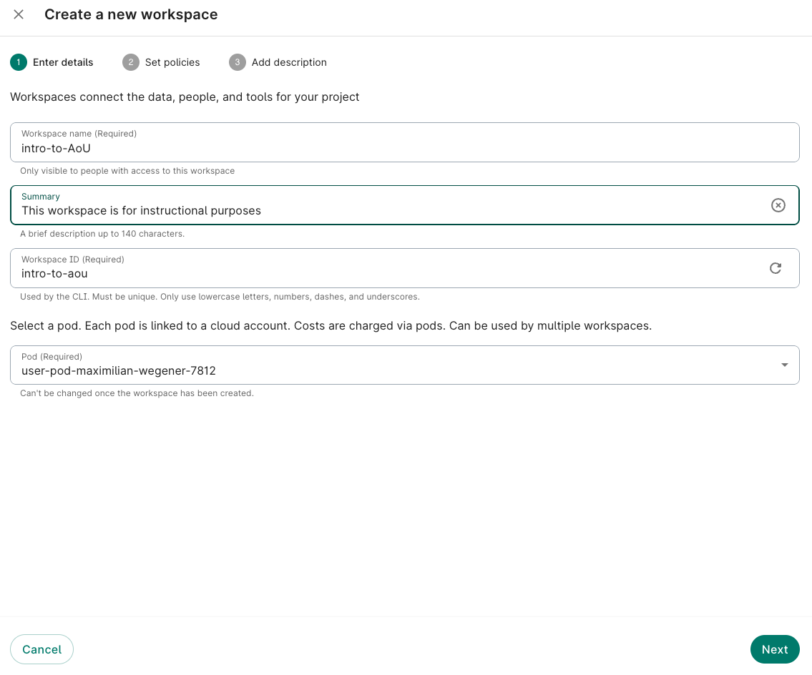
:::

:::: {.column .side width="45%"}
**You fill in:**

- **Workspace name:** only visible to people with access
- **Summary:** a short description (up to 140 characters)

**Filled in automatically:**

- **Workspace ID:** made from the name; used by the CLI
- **Pod:** your default billing pod

Click **Next**

::: fragment
⚠️ The pod **can't be changed** after the workspace is created
:::
::::
::::::

::: notes
The auto-selected pod is your personal user pod (user-pod-firstname-lastname-####). If you've set up a Yale billing pod, choose it here from the drop-down.
:::

## Step 2: Set Policies

:::::: columns
::: {.column width="55%"}
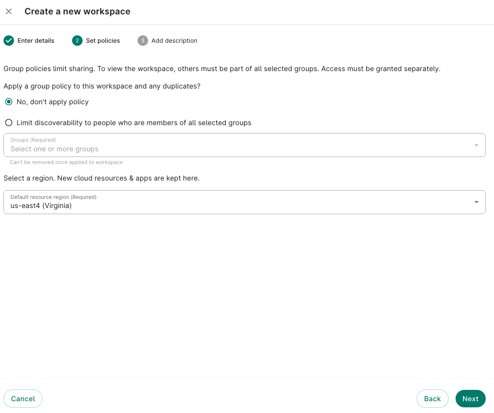
:::

:::: {.column .side width="45%"}
**Sharing (group policy):**

- **No, don't apply policy:** the default; fine for most projects
- **Limit discoverability:** only members of the selected groups can see the workspace

**Region:**

- Where your apps and cloud resources are kept
- Pick the one **closest to you**. At Yale: **us-east4 (Virginia)**

Click **Next**

::: fragment
⚠️ Group policies **can't be removed** once applied
:::
::::
::::::

::: notes
Group policies also carry over to duplicates of the workspace. Access still has to be granted separately; a group policy only limits who can be given access. Region also affects cost: Verily notes prices can vary by about 25% between regions. TODO: check which region the All of Us data lives in, since moving data across regions can add transfer costs.
:::

## Step 3: Add Description

:::::: columns
::: {.column width="55%"}
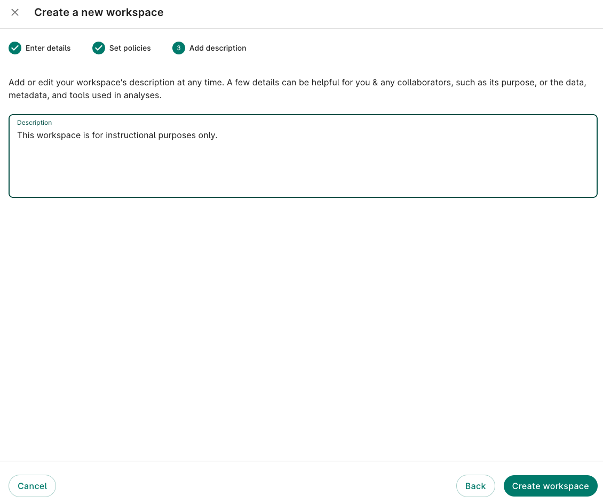
:::

:::: {.column .side width="45%"}
**Description:**

- What the workspace is for: its purpose, data, and tools
- Helps you and your collaborators
- You can **edit it any time**

Click **Create workspace**

::: fragment
⚠️ The description is **publicly accessible**. Anyone can see it, so don't put sensitive details in it.
:::
::::
::::::

## Your New Workspace

Go to the **Resources** tab → **+ Data from catalog**

::::: annotated
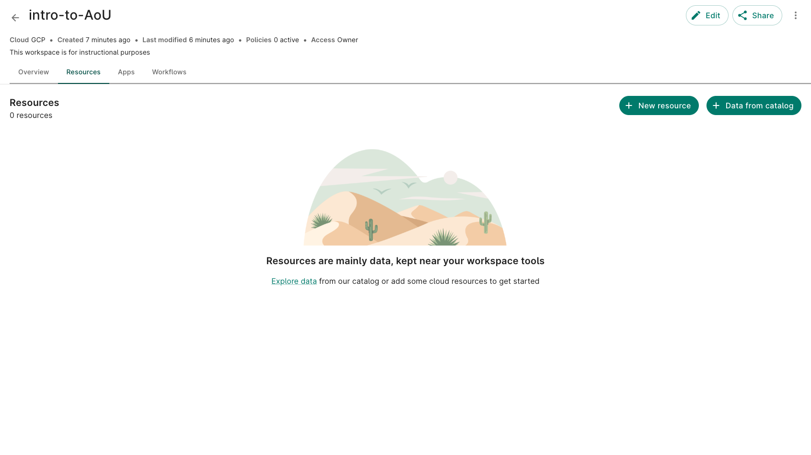

::: {.red-circle style="left: 6.4%; top: 13.4%; width: 7.4%; height: 6.2%;"}
:::

::: {.red-circle style="left: 86.0%; top: 19.2%; width: 13.8%; height: 8%;"}
:::
:::::

::: notes
Workspace tabs: Overview, Resources (data and cloud storage), Apps (JupyterLab, RStudio, SAS…), Workflows. Edit and Share are at the top right. A new workspace starts with 0 resources and 0 active policies; the policies come in when you add a data collection.
:::

## Adding a Data Collection

A new workspace has **no data** until you add a data collection.

**Resources** tab → **+ Data from catalog** (or **Add to workspace** on the Exchange), then:

1.  **Select collection:** All of Us Registered Tier or Controlled Tier
2.  **Select resource:** e.g., the CDR version
3.  **Review policies:** answer the **Researcher Use Statement** questions
4.  **Review selection** → **Add to your workspace**

## Step 1: Select Collection

::::::: columns
::::: {.column width="58%"}
:::: annotated
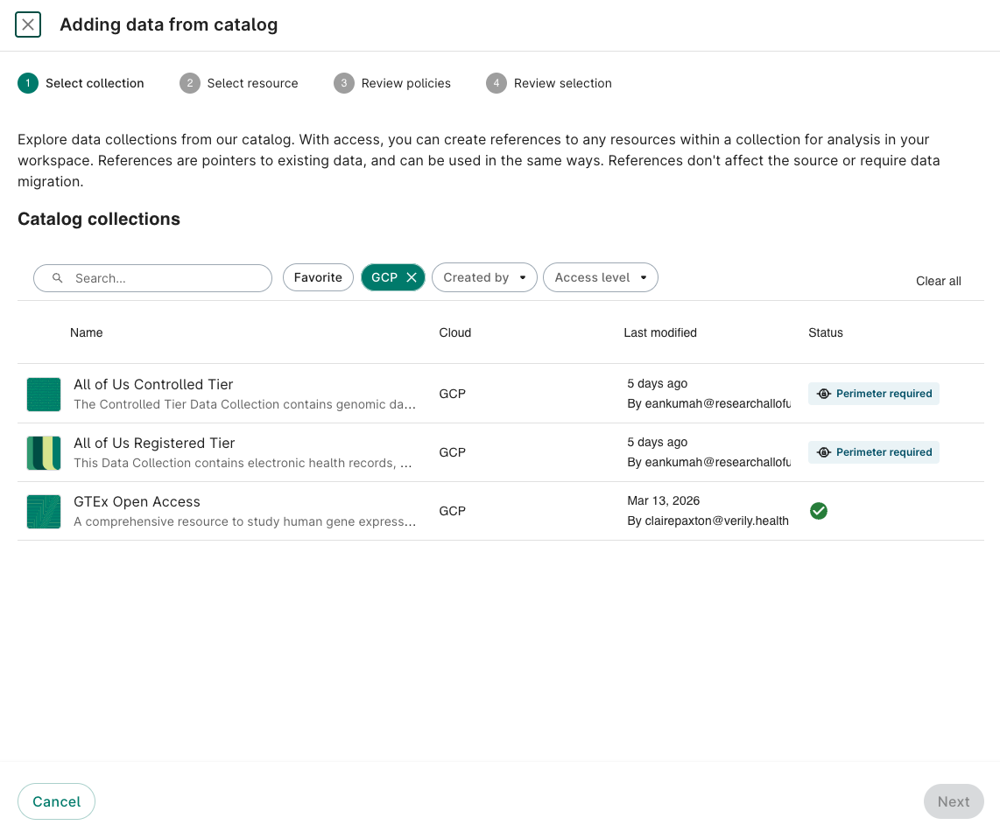

::: {.red-box style="left: 1.2%; top: 43.6%; width: 97.6%; height: 7%;"}
:::
::::
:::::

::: {.column .side width="42%"}
- Pick the collection you need. Here: **All of Us Controlled Tier**
- You add **references**: pointers to the existing data
  - No copying or data migration
  - The source data isn't affected
- **Status** column:
  - **Perimeter required:** adding it puts a security perimeter on your workspace
  - ✅ No extra policy needed (e.g., GTEx)

Click **Next**
:::
:::::::

::: notes
Only collections you have access to appear here (the same list as your Data collections page). The GCP filter is on by default.
:::

## Step 2: Select Resources

::::::: columns
::::: {.column width="58%"}
:::: annotated
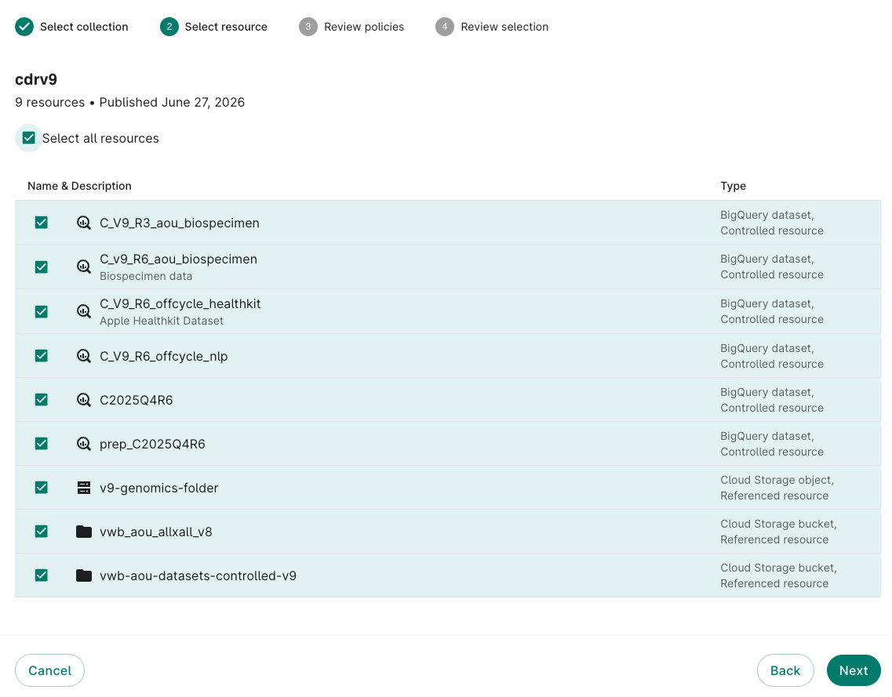

::: {.red-box style="left: 1.0%; top: 16.9%; width: 18%; height: 5.8%;"}
:::
::::
:::::

::: {.column .side width="42%"}
- The collection version (**cdrv9**) holds **9 resources**
- Choose **some or all**. Here: **Select all resources**
- Two kinds of resources:
  - **BigQuery datasets:** data tables you query with SQL
  - **Cloud Storage buckets/objects:** files, e.g., genomic data

Click **Next**
:::
:::::::

## What's in cdrv9 (Controlled Tier)?

| Resource | Type | What it holds |
|------------------------|------------------------|------------------------|
| `C2025Q4R6` | BigQuery | The main CDR: OMOP tables (EHR, surveys, measurements…) |
| `prep_C2025Q4R6` | BigQuery | Prep tables that support the CDR tools |
| `C_V9_R3_aou_biospecimen`, `C_v9_R6_aou_biospecimen` | BigQuery | Biospecimen data |
| `C_V9_R6_offcycle_healthkit` | BigQuery | Apple HealthKit data |
| `C_V9_R6_offcycle_nlp` | BigQuery | NLP-derived data from clinical notes |
| `v9-genomics-folder` | Cloud Storage | Genomic data files |
| `vwb_aou_allxall_v8` | Cloud Storage | All by All (v8) association results |
| `vwb-aou-datasets-controlled-v9` | Cloud Storage | Controlled Tier dataset files |

::: notes
Some descriptions are inferred from the resource names. TODO: confirm prep\_, offcycle_nlp, and vwb-aou-datasets-controlled-v9 against the All of Us docs.
:::

## Step 3: Review Policies

:::: {.columns}
::: {.column width="58%"}
::: {.annotated}
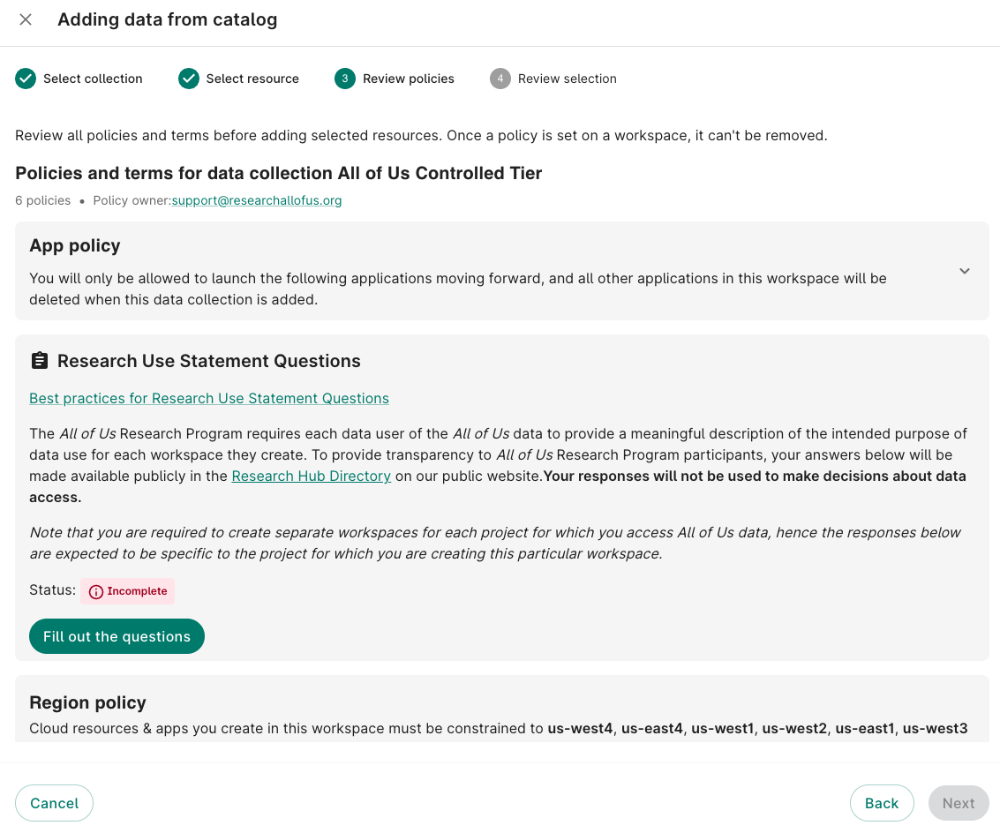

::: {.red-circle style="left: 1.6%; top: 72.4%; width: 20.4%; height: 5.8%;"}
:::
:::
:::
::: {.column .side width="42%"}
The Controlled Tier has **6 policies**, including:

- **App policy:** only approved apps can run; other apps in the workspace are **deleted**
- **Region policy:** apps and resources must stay in approved US regions
- **Research Use Statement:** click **Fill out the questions**. You **can't continue** until it's complete.

::: {.fragment}
⚠️ Your answers are **public** in the [Research Hub Directory](https://www.researchallofus.org/research-projects-directory/)

⚠️ Policies **can't be removed** once set
:::
:::
::::

::: notes
The answers aren't used to make data access decisions; they're for transparency to participants. All of Us expects a separate workspace for each project, so the answers should be specific to this project. Scroll down in the dialog to see all 6 policies.
:::

## Research Use Statement: Question 1

:::: {.columns}
::: {.column width="58%"}
::: {.annotated}
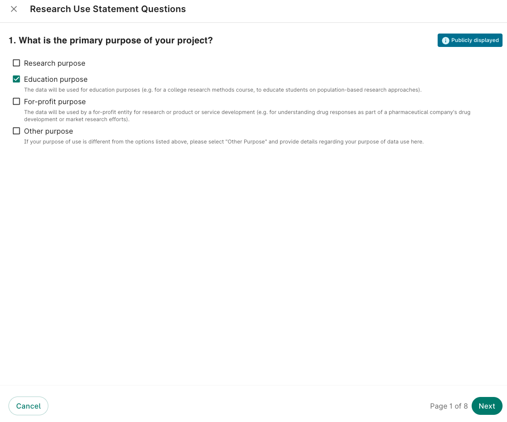

::: {.red-box style="left: 1.6%; top: 17.2%; width: 83%; height: 5.6%;"}
:::
:::
:::
::: {.column .side width="42%"}
**What is the primary purpose of your project?**

- Research
- **Education** ← our example (instructional workspace)
- For-profit
- Other

8 pages of questions in total

::: {.fragment}
Answer for **your own project**. Answers marked **Publicly displayed** appear in the Research Hub Directory.
:::
:::
::::

::: notes
This example workspace is for teaching, so we answer as an education project. Students doing research should choose Research purpose and describe their actual project.
:::

## Research Use Statement: Question 2

:::: {.columns}
::: {.column width="58%"}
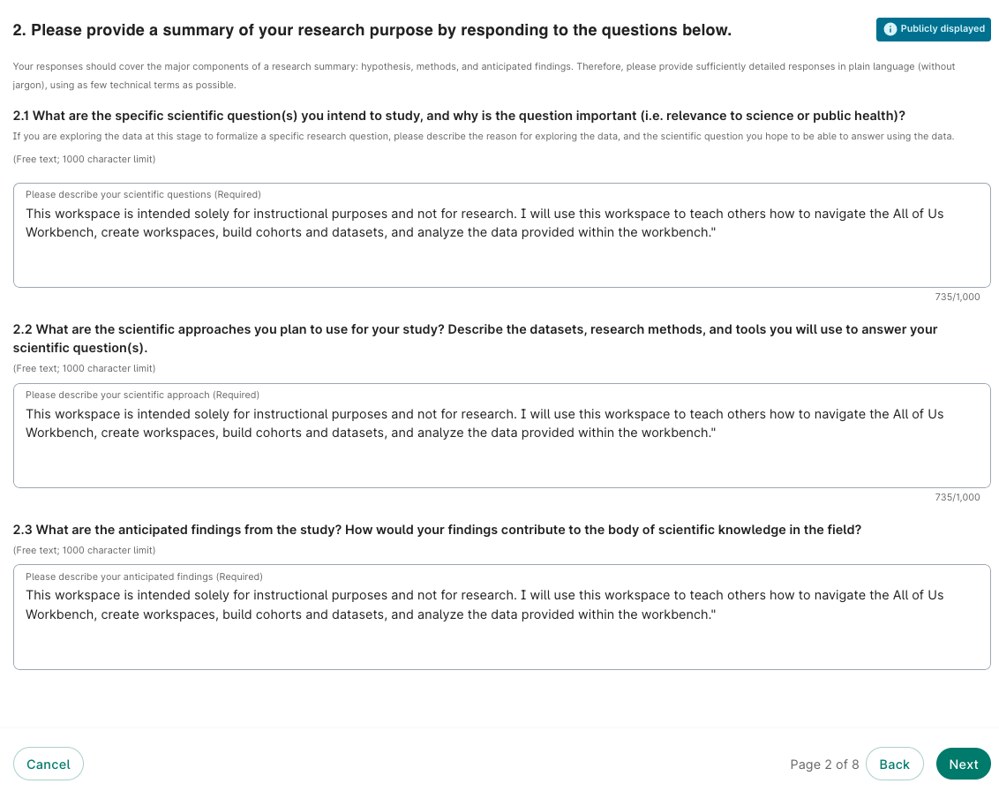
:::
::: {.column .side width="42%"}
**Summarize your research purpose** in plain language:

- **2.1** Your scientific question(s), and why they matter
- **2.2** Your approach: datasets, methods, and tools
- **2.3** Your anticipated findings

Each answer: **100–1,000 characters**

::: {.fragment}
⚠️ Answers under 100 characters give an error. Add enough detail to explain your project.
:::
:::
::::

::: notes
Example answer for this instructional workspace (used for 2.1–2.3): "This workspace is intended solely for instructional purposes and not for research. I will use this workspace to teach others how to navigate the All of Us Workbench, create workspaces, build cohorts and datasets, and analyze the data provided within the workbench." Students should describe their real project: hypothesis, methods, and expected findings, with as little jargon as possible.
:::

## Research Use Statement: Question 3

:::: {.columns}
::: {.column width="58%"}
::: {.annotated}
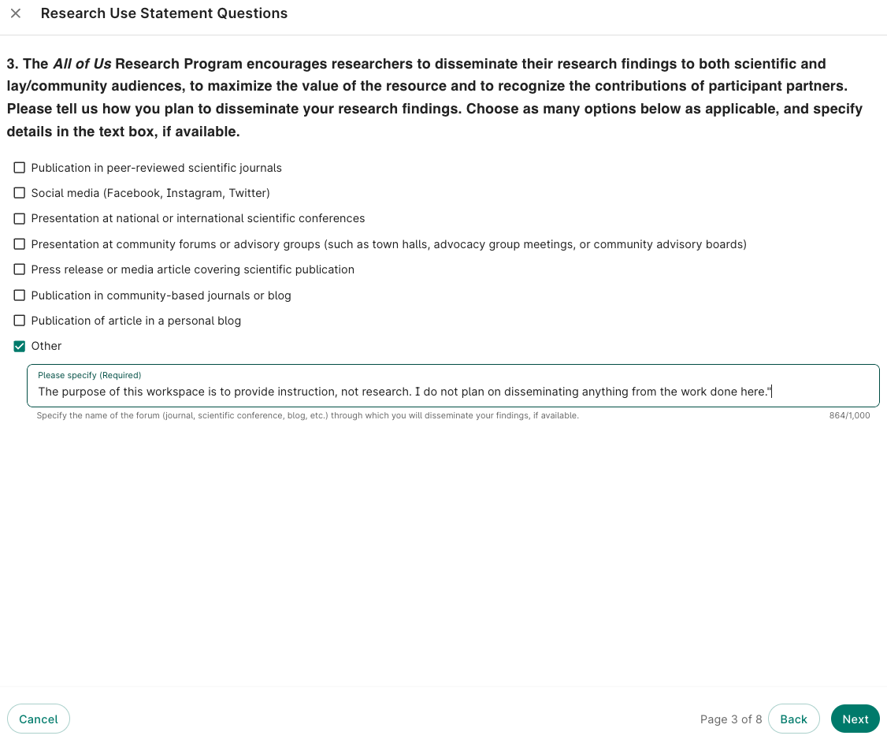

::: {.red-box style="left: 0.8%; top: 44.8%; width: 98.8%; height: 10.8%;"}
:::
:::
:::
::: {.column .side width="42%"}
**How will you share your findings?**

- Choose **all that apply**: journals, conferences, community forums, social media, blogs, press…
- Name the venue if you know it (journal, conference, blog, etc.)
- **Other** requires a short explanation

::: {.fragment}
Our example: **Other**. The workspace is for teaching, so there are no findings to share.
:::
:::
::::

::: notes
All of Us encourages sharing results with both scientific and community audiences, to recognize participants' contributions. Example answer: "The purpose of this workspace is to provide instruction, not research. I do not plan on disseminating anything from the work done here."
:::

## Research Use Statement: Question 4

:::: {.columns}
::: {.column width="58%"}
::: {.annotated}
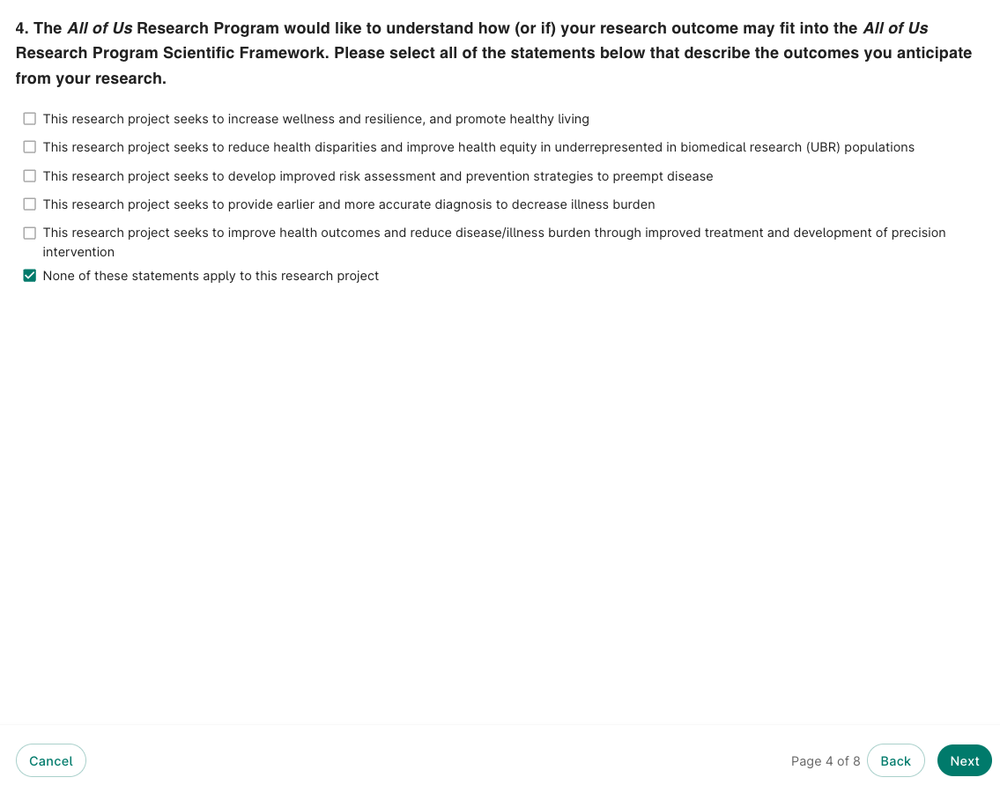

::: {.red-box style="left: 1.4%; top: 33.2%; width: 38.4%; height: 3.8%;"}
:::
:::
:::
::: {.column .side width="42%"}
**How does your project fit the All of Us Scientific Framework?**

Select all outcomes you expect:

- Wellness, resilience, healthy living
- Health equity for underrepresented (UBR) populations
- Risk assessment and prevention
- Earlier, more accurate diagnosis
- Better treatment and precision interventions

::: {.fragment}
Our example: **None of these apply** (teaching workspace)
:::
:::
::::

## Research Use Statement: Question 5

:::: {.columns}
::: {.column width="58%"}
::: {.annotated}
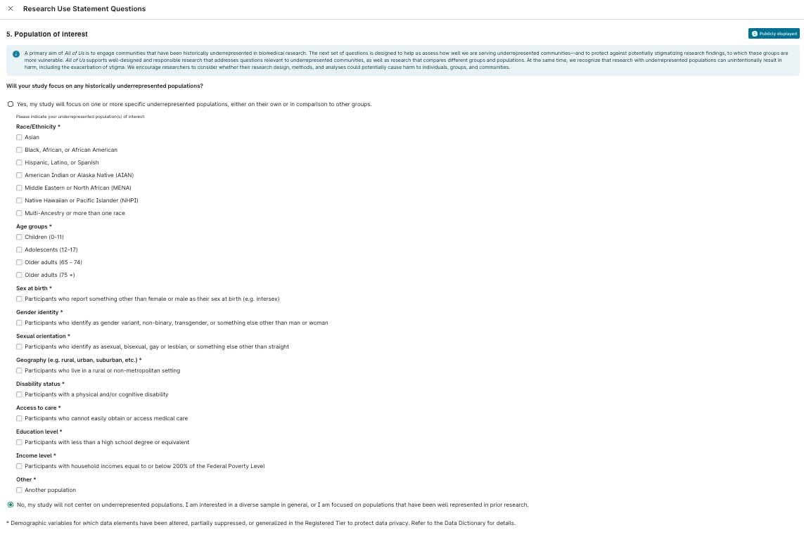

::: {.red-box style="left: 0.4%; top: 89.9%; width: 66.4%; height: 3.4%;"}
:::
:::
:::
::: {.column .side width="42%"}
**Population of interest:** will your study focus on historically underrepresented populations?

- **Yes:** select the groups, e.g., race/ethnicity, age, sex at birth, gender identity, sexual orientation, geography, disability, access to care, education, income
- **No:** a diverse sample in general, or well-represented populations

::: {.fragment}
Our example: **No** (teaching workspace)
:::
:::
::::

::: notes
All of Us asks this to track how well it serves underrepresented communities and to guard against stigmatizing findings. Encourage students to think about whether their design, methods, or analyses could harm individuals, groups, or communities. Fields marked * are altered, suppressed, or generalized in the Registered Tier for privacy; see the Data Dictionary.
:::

## Research Use Statement: Question 6

:::: {.columns}
::: {.column width="58%"}
::: {.annotated}
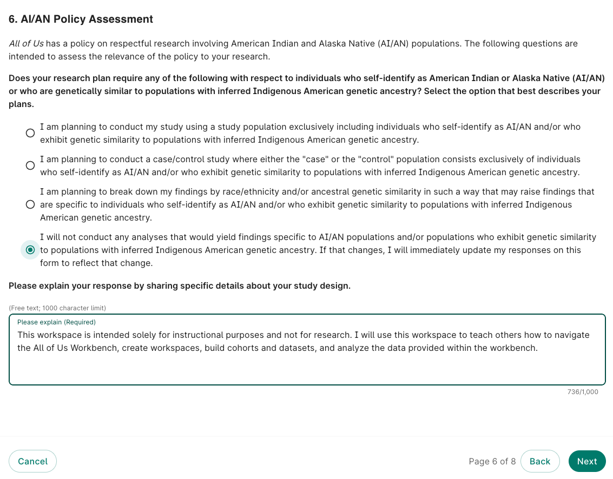

::: {.red-box style="left: 2.6%; top: 47.6%; width: 95.8%; height: 9%;"}
:::
:::
:::
::: {.column .side width="42%"}
**AI/AN Policy Assessment**

Will your study produce findings specific to **American Indian and Alaska Native (AI/AN)** populations?

- AI/AN-only study population
- AI/AN case or control group
- Results broken down so AI/AN-specific findings may appear
- **No AI/AN-specific analyses**

Then explain your answer (required)

::: {.fragment}
Our example: **no AI/AN-specific analyses**. If that changes, you must update your answers.
:::
:::
::::

::: notes
All of Us has a policy on respectful research with AI/AN populations; this question checks whether it applies to your project. Students whose work could produce AI/AN-specific findings should read the policy before starting.
:::

## Research Use Statement: Question 7

**Request a review of your research purpose?**

- Research using **demographic variables** can unintentionally produce findings that **stigmatize** participants or communities
- You can ask the **Resource Access Board (RAB)** to review your purpose
  - Reply within **5 business days**; keep working meanwhile
- This answer is **private** (not on the Research Hub)

::: {.fragment}
Our example: **No** concerns. The RAB is available any time via the **User Support Hub**.
:::

::: notes
See the All of Us Stigmatizing Research Policy for more detail. If students are unsure, encourage them to request the review; it's a precaution, not a penalty.
:::

## Research Use Statement: Page 8

**Review and confirm**

These answers are **publicly displayed** to inform All of Us participants:

- **Q1** Primary purpose of your project
- **Q2** Summary of research purpose
- **Q5** Population of interest
- **Q6** Approach to handling AI/AN data

Check that they're detailed and in plain language, then click **Confirm**

::: {.fragment}
You can go **Back** to change answers now, or edit them later after the workspace is created
:::

::: notes
Q3 (dissemination), Q4 (scientific framework), and Q7 (RAB review) are not displayed publicly. TODO: add screenshots for Q7 and page 8 (save as images/rus_q7.png and images/rus_q8.png).
:::

## Step 3: Confirm Policies

:::: {.columns}
::: {.column width="58%"}
::: {.annotated}
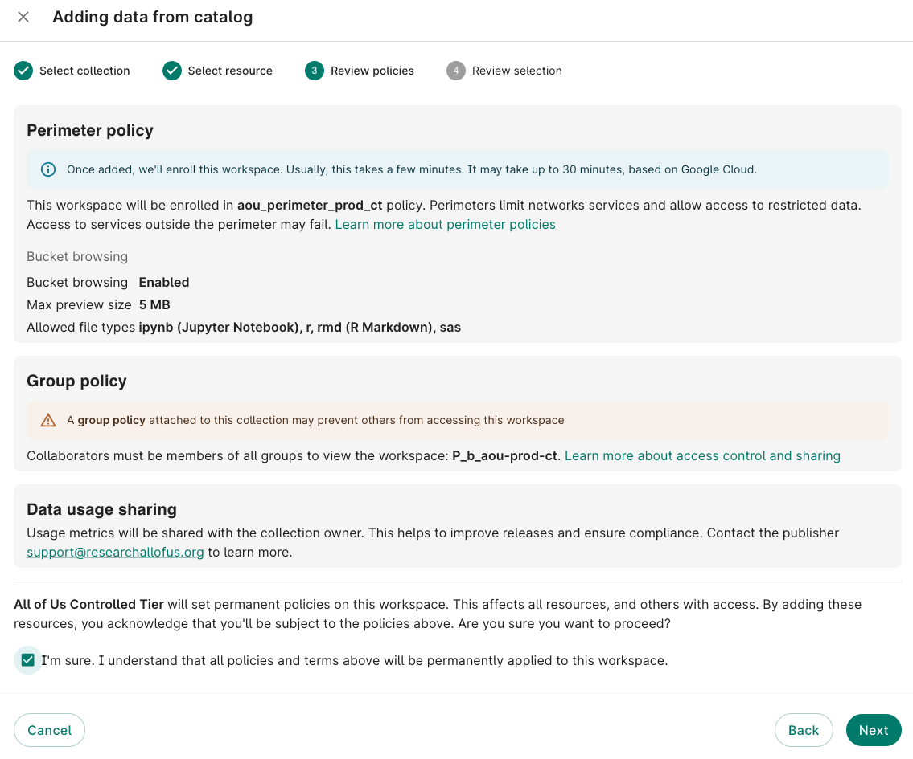

::: {.red-box style="left: 0.8%; top: 84.4%; width: 73.4%; height: 5.4%;"}
:::

::: {.red-circle style="left: 91.4%; top: 93.0%; width: 8.6%; height: 6.6%;"}
:::
:::
:::
::: {.column .side width="42%"}
Scroll to the bottom of **Review policies**:

- **Perimeter policy:** the workspace is enrolled in a secure perimeter (can take up to **30 min**); services outside it may fail
- **Group policy:** collaborators must be in the All of Us Controlled Tier group
- **Data usage sharing:** usage metrics go to All of Us

Check **I'm sure…** → **Next**

::: {.fragment}
⚠️ These policies are **permanent** for this workspace
:::
:::
::::

::: notes
Bucket browsing in the perimeter: previews up to 5 MB, and only .ipynb, .r, .rmd, and .sas files can be viewed. The group is P_b_aou-prod-ct, so collaborators need Controlled Tier access too.
:::

## Step 4: Review Selection

:::: {.columns}
::: {.column width="58%"}
::: {.annotated}
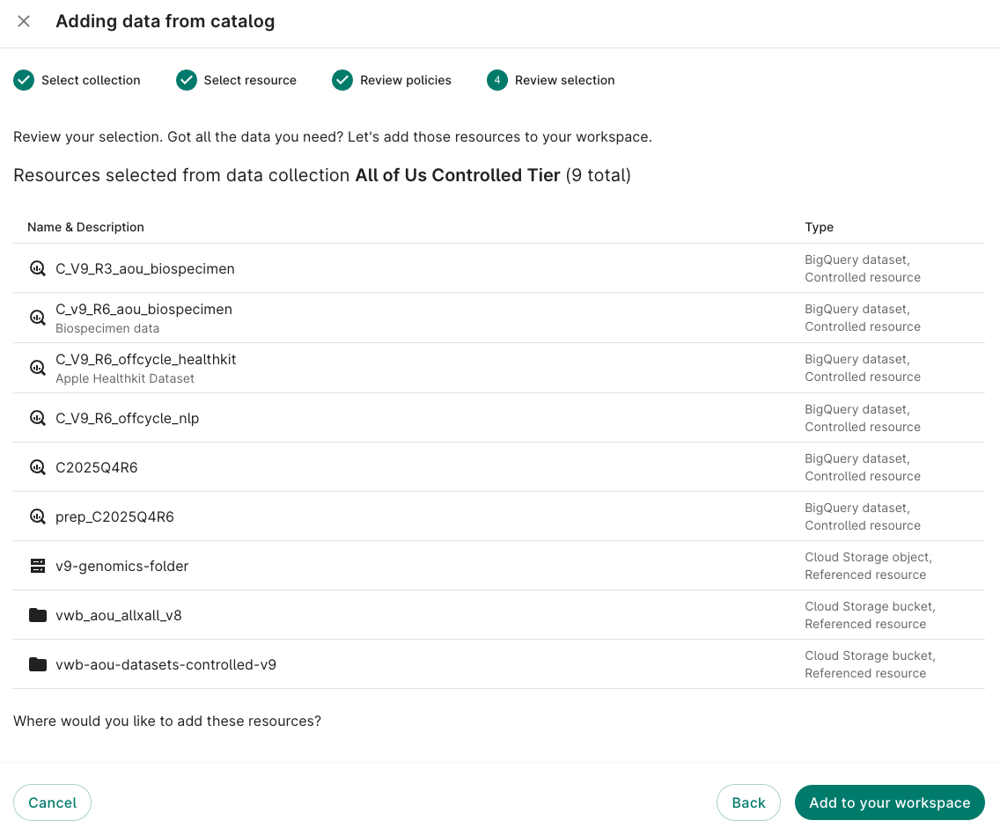

::: {.red-circle style="left: 78.4%; top: 92.8%; width: 21%; height: 6.6%;"}
:::
:::
:::
::: {.column .side width="42%"}
- Check the list of resources: **9** from the All of Us Controlled Tier
- Missing something? Go **Back**
- Click **Add to your workspace**

::: {.fragment}
The resources then appear in your workspace's **Resources** tab. Allow up to **30 min** for the perimeter enrollment to finish.
:::
:::
::::

## Data Collection Rules

- Add it **to every workspace** that needs All of Us data
- Policies are **permanently** applied to the workspace
- **One tier per workspace:** Registered *or* Controlled, not both
- The workspace also takes on the collection's:
  - **Perimeter policy**
  - **Network policy:** no internet access for batch VMs and Dataproc workers
- Each user still needs the matching tier access on their own account

# Data Explorer

## Data Explorer

- A point-and-click tool for building datasets from All of Us data collections
- Replaces the classic **Cohort Builder**, **Concept Selector**, and **Dataset Builder**
- Lets you:
  - Explore the data visually
  - Design custom cohorts
  - Export datasets directly to your workspace

## Building a Cohort

- Select your study population with inclusion/exclusion criteria (AND/OR)
- Demographics, conditions, measurements, medications, procedures, surveys

::: fragment
**Example criteria:**

- Sex → Woman
- Age → 65 or older
- Condition → Breast cancer
- Medication → Tamoxifen
:::

::: notes
TODO: screenshot of the cohort builder in Data Explorer. Check whether temporal criteria are still supported.
:::

## Concepts and Domains

| Domain                | Description                                    |
|-----------------------|------------------------------------------------|
| Conditions            | SNOMED standard codes (mapped from ICD9/ICD10) |
| Procedures            | SNOMED, CPT, ICD codes                         |
| Drugs                 | RxNorm; listed by ingredient                   |
| Measurements          | Labs and vitals, LOINC hierarchy               |
| Visits                | ED, outpatient, inpatient                      |
| Surveys               | Questions and responses                        |
| Physical Measurements | BP, HR, height, weight, BMI at enrollment      |
| Demographics          | Age, gender, race, ethnicity, deceased status  |

## OMOP Common Data Model

- An open standard for organizing and coding medical data consistently
- Each **concept** has a unique numeric `concept_id`
- All variations of the same clinical idea map to one **standard concept**
  - e.g., ICD-10 at one site and SNOMED-CT at another map to the same ID
- Explore the vocabularies at [Athena](https://athena.ohdsi.org/)

## Data Snapshot and Export

- After saving a cohort, create a **data snapshot**
  - Add concept criteria to build your dataset
- Export to your workspace as:
  - `.csv` files (zipped or unzipped)
  - Notebooks (`.ipynb`) with the SQL queries, in **R** or **Python**

::: notes
TODO: screenshots of the snapshot and export dialog.
:::

# Apps

## Launching an App

- Apps are the analysis environments in 2.0
- In the workspace: **Apps** → **New app instance**
- Four steps:
  1.  **Select app**
  2.  **Choose config**
  3.  **Compute options**
  4.  **Review details** → **Create app**
- Once it's created, click the app's name to open it

## Step 1: Select App

::::: columns
::: {.column width="45%"}
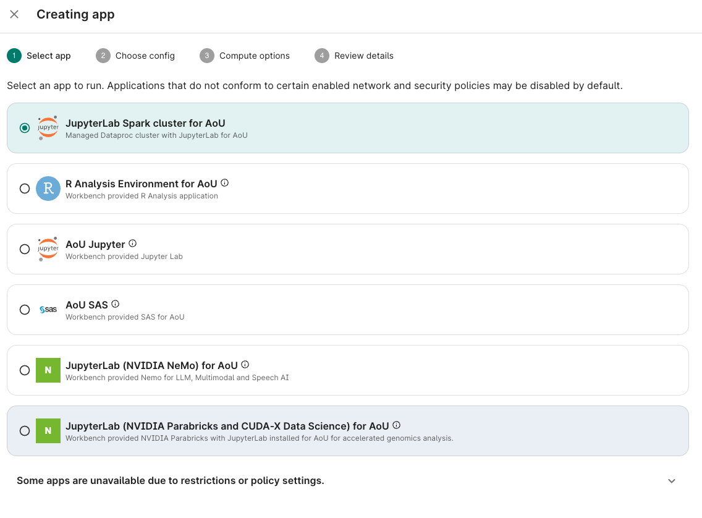
:::

::: {.column .small width="55%"}
| App | Use it for |
|------------------------------------|------------------------------------|
| **JupyterLab Spark cluster** | Large-scale and genomic analysis on a Dataproc cluster |
| **R Analysis Environment** | R / RStudio |
| **AoU Jupyter** | Standard JupyterLab (Python or R notebooks) |
| **AoU SAS** | SAS |
| **JupyterLab (NVIDIA NeMo)** | LLMs, multimodal, and speech AI (GPU) |
| **JupyterLab (NVIDIA Parabricks + CUDA-X)** | GPU-accelerated genomics |
:::
:::::

::: {style="font-size: 0.6em;"}
Some apps may be disabled by your workspace's network or security policies.
:::

## Step 2: Choose Config

::::: columns
::: {.column width="60%"}
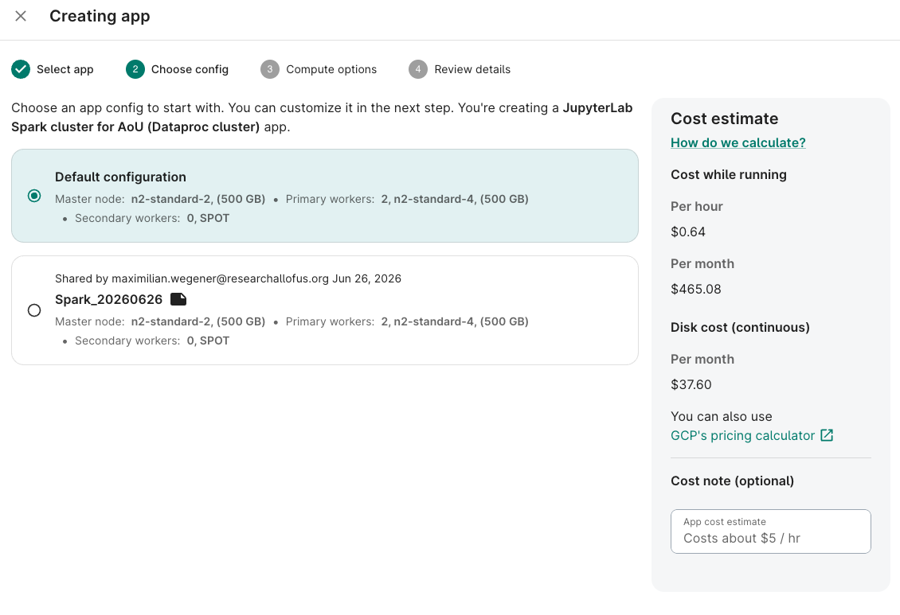
:::

::: {.column width="40%"}
- Start from the **Default configuration**...
- ...or from a **saved configuration** that you or a collaborator shared
- The **Cost estimate** panel appears on the right
:::
:::::

::: notes
This screenshot shows the presenter's email under the shared config. Crop or blur it if needed.
:::

## Step 3: Compute Options

::::: columns
::: {.column width="60%"}
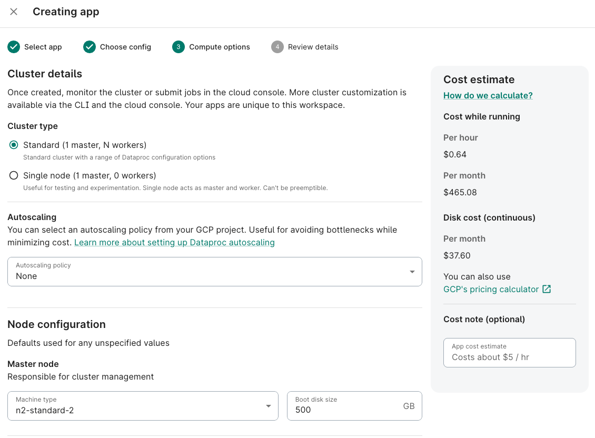
:::

::: {.column width="40%"}
- Customize the app's resources:
  - Machine type (CPUs + memory)
  - Disk size
  - For Spark clusters: cluster type, number of workers, autoscaling
- The cost estimate **updates as you change settings**
:::
:::::

::: notes
Spark cluster options: Standard (1 master, N workers) or Single node (1 master, 0 workers). Single node is useful for testing.
:::

## Step 4: Review Details

::::: columns
::: {.column width="60%"}
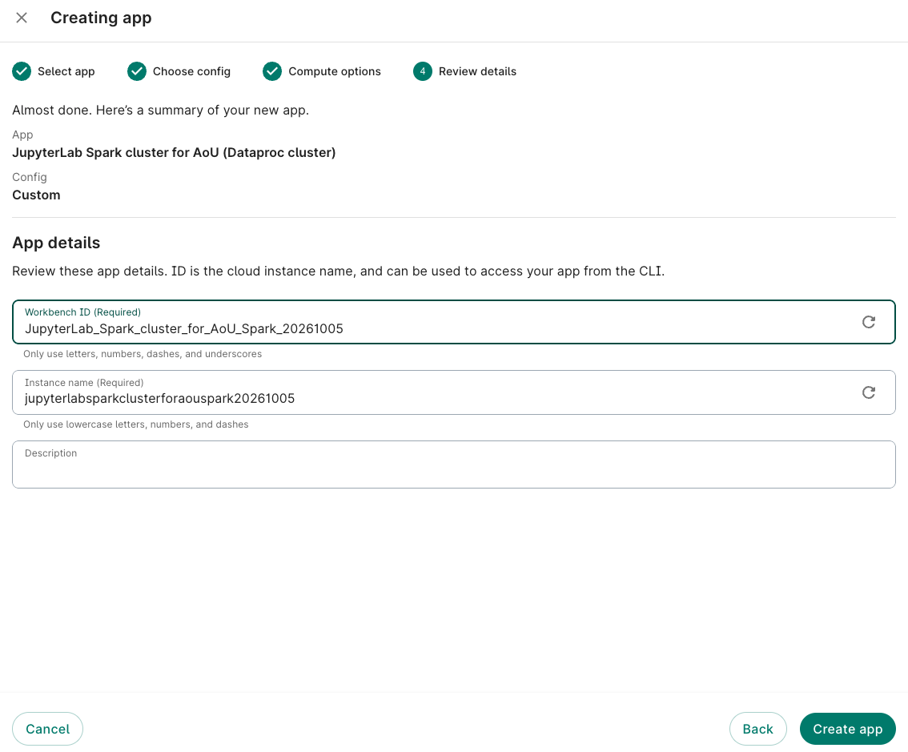
:::

::: {.column width="40%"}
- **Workbench ID:** letters, numbers, dashes, underscores
- **Instance name:** lowercase letters, numbers, dashes
- Add an optional **Description**
- Click **Create app**
:::
:::::

## Working in Your App

- One query per domain/concept set
- Write your own code to clean and manipulate the data
- **Save cleaned data to workspace storage** so you don't re-run the queries every session

# Storage & Costs

## Storage

- **Workspace cloud storage (bucket):** shared, permanent, and the cheapest option for long-term storage. Recommended.
- **App disk:** attached to an app instance; charged while it exists

::: notes
TODO: confirm how app disks behave in 2.0 when an app is stopped or deleted.
:::

## Saving Money

- Save your data to workspace storage
- **Stop or delete apps** you aren't using
- Your notebooks and data in workspace storage stay intact
- Start a new app any time to pick up where you left off
- Delete workspaces you no longer need

## Built-in App Cost Estimates

The **Cost estimate** panel (steps 2–3 of creating an app) shows:

- **Cost while running:** per hour and per month
- **Disk cost (continuous):** per month, charged **even when the app is stopped**
- A link to **GCP's pricing calculator**
- An optional **cost note** you can save with the config

::: fragment
**Example:** default JupyterLab Spark cluster

- \$0.64/hour running → about **\$465/month** if left on
- Plus **\$37.60/month** for disks until the app is deleted
:::

::: fragment
**Not included:** BigQuery query costs, workspace bucket storage, and data transfer
:::

::: notes
Source: Verily, "Cloud app cost estimates". This replaces the My AoU Cost Estimator app from Session 1.
:::

# Wrap-up

## Helpful Resources

- [Researcher Workbench Getting Started Guide](https://support.researchallofus.org/hc/en-us/articles/41981050556564-Researcher-Workbench-Getting-Started-Guide)
- [Workbench 2.0 Glossary of Terms and Comparison Guide](https://support.researchallofus.org/hc/en-us/articles/44371414196116-Researcher-Workbench-2-0-Glossary-of-Terms-and-Comparison-Guide)
- [Data Explorer in Researcher Workbench](https://support.researchallofus.org/hc/en-us/articles/41981213271188-Data-Explorer-in-Researcher-Workbench)
- [Using All of Us Initial Credits](https://support.researchallofus.org/hc/en-us/articles/28920849686036-Using-All-of-Us-Initial-Credits)
- [Set up billing with pods (Verily)](https://support.workbench.verily.com/docs/getting_started/billing_setup/)
- [Verily Workbench documentation](https://support.workbench.verily.com/docs/)

## Future Directions

Future CWML/BIDS courses to help you work with All of Us:

- R, Python, SQL
- OMOP Common Data Model
- Open to suggestions!
- Let us know if you'd like to present your All of Us work
- Check the library training calendar for current courses

## Questions {.center}

## Course Survey {.center}

[Course survey](https://yalesurvey.ca1.qualtrics.com/jfe/form/SV_cZOk3RQmTrQLhYy)